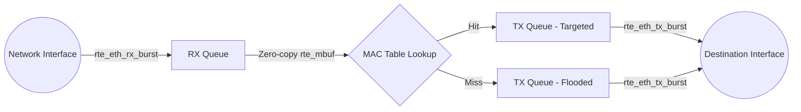

# DPDK Fast Switch

> **Project Summary:**  
> A Layer 2 fast-path switch built in C11 using the Data Plane Development Kit (DPDK). It demonstrates deep understanding of `rte_mbuf` zero-copy lifecycle management and fast MAC address learning using `rte_hash`. It streams live port statistics via IPC and conforms to strict DPDK C standards with a Pitchfork layout and CMake toolchain.

## Table of Contents
1. [System Architecture](#system-architecture)
2. [Getting Started](#getting-started)
3. [Usage](#usage)

## System Architecture



## Getting Started

### Prerequisites
- C11 compatible compiler
- DPDK Development Libraries (`libdpdk-dev`)
- CMake >= 3.14

### Build Instructions
```bash
mkdir build && cd build
cmake ..
cmake --build .
```

### Docker (Cloud Native Network Function - CNF)
To run this switch as a containerized network function, build the provided Dockerfile:

```bash
docker build -t dpdk_fast_switch .
docker run --rm --privileged \
  -v /sys/bus/pci:/sys/bus/pci \
  -v /sys/kernel/mm/hugepages:/sys/kernel/mm/hugepages \
  dpdk_fast_switch -c 0x3 -n 4
```

## Usage
Requires `root` privileges to initialize DPDK EAL and allocate hugepages.
```bash
sudo ./dpdk_fast_switch -c 0x3 -n 4
```
